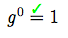
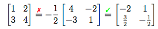

# LaTeXEqChecker
A framework for checking math equations etc. in LaTeX documents and annotation of correctness.

Help page: `$ ./texEqCheck.py -h`

## Examples
Here are some examples for the annotation of equations:

* 
* 
* 
* 
* 
* 
* 
* 
* 

## Abstract (preliminary)

### German

#### LaTeXEqChecker - Ein Framework zur Überprüfung mathematischer Semantik in LaTeX Dokumenten

Mathe-Übungsblätter zu korrigieren, ist eine mühsame Aufgabe - besonders dann, wenn die Abgabe viele falsche Gleichungen enthält, während das Ergebnis sogar richtig zu sein scheint.
Aus diesem Grund entwickle ich ein Programm, das Gleichungen in LaTeX-Dokumenten auf Korrektheit überprüft.
Das Programm hat nicht den Anspruch, jede Gleichung überprüfen zu können, da dies bewiesenermaßen unmöglich ist.
Ausgangspunkt ist ein LaTeX-Dokument, welches die Gleichungen enthält. Dieses wird so verarbeitet, dass es Anmerkungen und Korrekturen enthält.
So kann die Abgabe angenehmer und effizienter korrigiert werden.
Das Programm basiert auf Python und überprüft die Gleichungen mithilfe verschiedener Ansätze basierend auf Computer Algebra Systemen.

### English

#### LaTeXEqChecker - A framework for checking mathematical semantics in LaTeX documents

Correcting students math problem sets is a laborious work - especially if there are lots of wrong equations, while the result is correct or at least seems to be.
For the purpose of easing this work I developed a software that checks whether equations are correct.
It doesn’t lay the claim to be able to check every equation which is basically impossible.
The input is a by the student generated TeX file. The output is a similar TeX file that has annotations and corrections included.

A further application is to use it for double checking proofs and/of papers.

